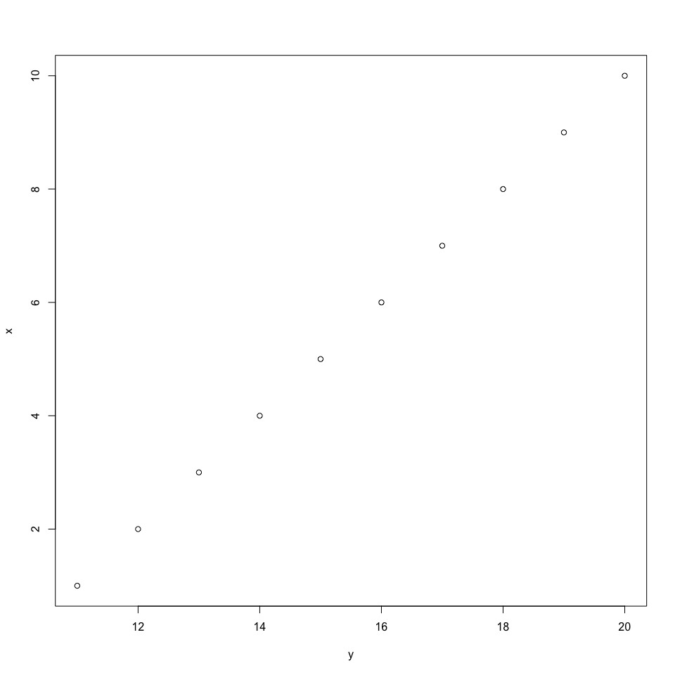
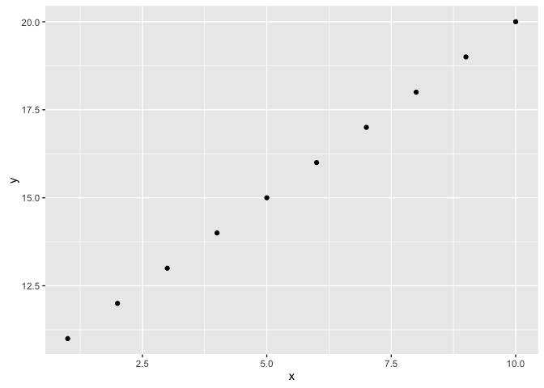

# your report name
your names  

__remember to commit and push README.md along with REAMDE.Rmd__

# Header 1
## Header 2
### Header 3
#### Header 4
##### Header 5
###### Header 6


Plain text

End a line with two spaces to start a new paragraph.

*italics* and _italics_

**bold** and __bold__

superscript^2^

~~strikethrough~~

[link](www.rstudio.com)


endash: --
emdash: ---
ellipsis: ...

inline equation: $A = \pi*r^{2}$

image: 

horizontal rule (or slide break):
***

> block quote

* unordered list
* item 2
  + sub-item 1
  + sub-item 2

1. ordered list
2. item 2
  + sub-item 1  
  + sub-item 2

Table Header  | Second Header
------------- | -------------
Table Cell    | Cell 2
Cell 3        | Cell 4


##display r codes, results and plots

code chunks in Rmarkdown start with \```{r} and end with \```

###display codes and results
Pay attention the use of echo and include. echo will hide the code, only showing the console results. include will hide both the code and results.


```r
print("hello")
```

```
## [1] "hello"
```


```
## [1] "hello"
```


###plots


experiment with fig.width and fig.height to find appropriate size of the plot?

```r
plot(x~y,data=df)
```

<!-- -->


```r
plot(x~y,data=df)
```

<!-- -->

You are recommended to learn ggplot2 to plot esthetic graphs


```r
qplot(x, y, data=df)
```

<!-- -->

